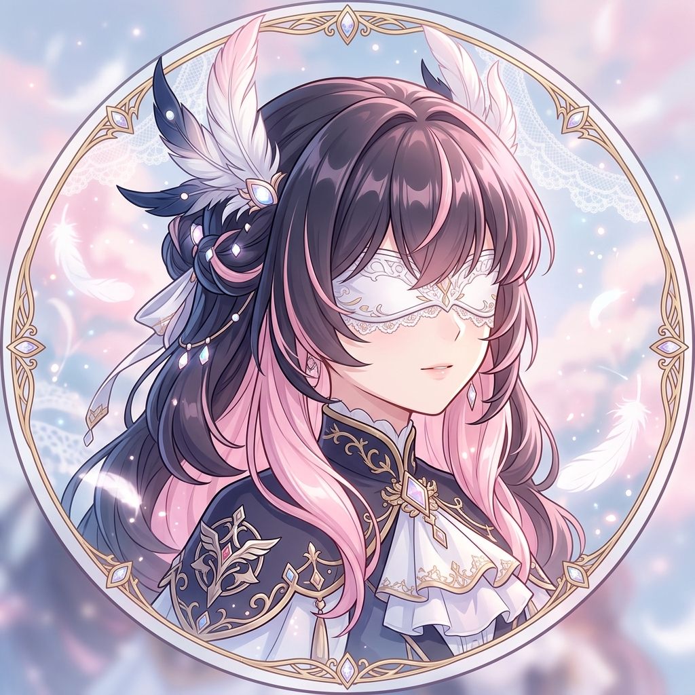
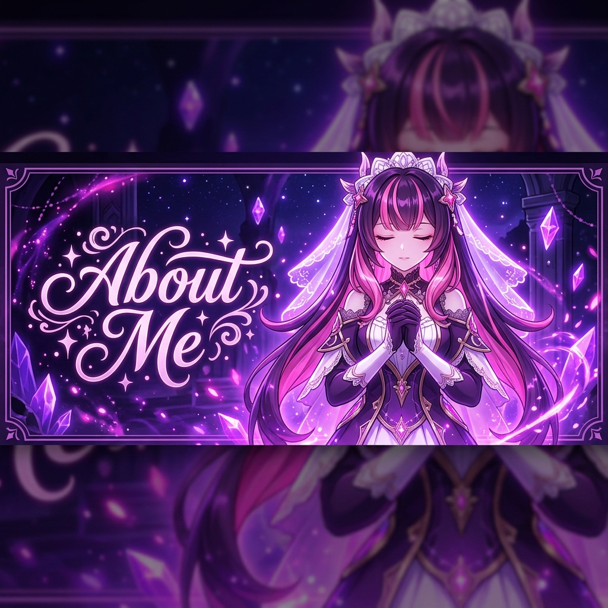
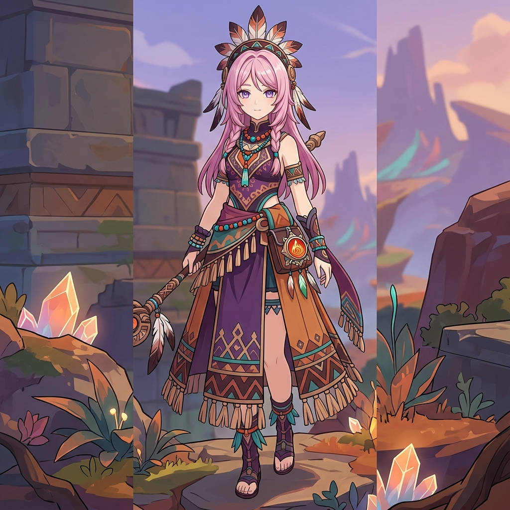
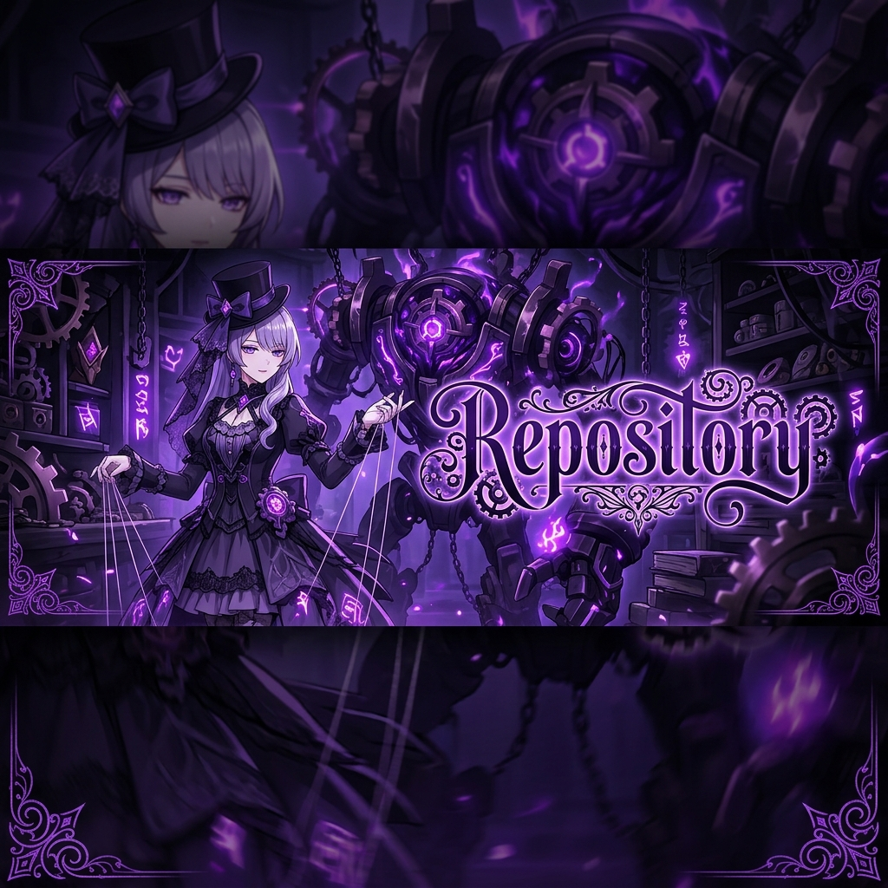

#

 

 
 

- 🇷🇺 **Full-Stack Developer & Desktop Client Architect from Russia** 
- 🎮 I enjoy programming, playing Genshin Impact, Rhythia, watching Twitch streams, and gacha games *(Columbina, Sandrone & Citlali main!)* 🌸
  ↳ **Favorite games:** Genshin Impact, Honkai: Star Rail, Muse Dash, Osu!

- I'm quite skilled with  **TypeScript**,  **JavaScript** and  **Node.js**
- I can read and understand code written in  **Python**,  **C#**,  **C++** and  **Electron**
- I’m currently exploring  **Go** and  **Rust**

 
 

 
 

- 🟦 **[WhiteCord](https://github.com/WhiteCord/WhiteCord)**
  A custom high-performance Discord desktop mod with native Telegram Web integration, stream privacy & custom packs
- 🔮 **[mentalscript](https://github.com/mentalscript/mentalscript)**
  Personal profile repository & custom developer tools

 
 
 

  
  

